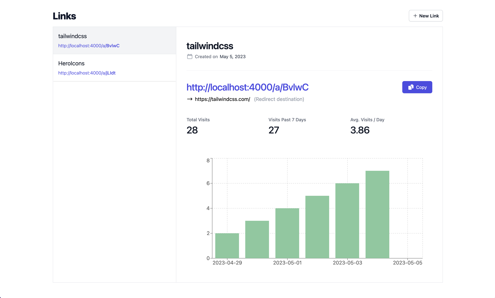

# Shrtnr

<p align="center">
  
</p>

`shrtnr` is an application that creates short links and captures visit metrics similar to [bit.ly](https://bitly.com/). This repo serves to document the project and provide a single `docker-compose.yml` file to build and run the project.  The application is composed of code from the following github repos:
- [matthewsaunders/link-shortener-api](https://github.com/matthewsaunders/link-shortener-api)
- [matthewsaunders/link-shortener-app](https://github.com/matthewsaunders/link-shortener-app)


To learn more about the application architecture and implementation, read through the docs linked below:

| Doc | Description |
|---|---|
| [Architecture](docs/ARCHITECTURE.md) | An overview of the application architecture and the major components. |
| [App](docs/APP.md) | An overview of the app component. |
| [API](docs/API.md) | An overview of the app component. |


---


## App setup

Follow the steps in this section to setup and run the application locally using docker.

### Assumptions
- You have docker installed on your device.

### Steps

1. Build the docker containers
```
docker compose build
```

2. Run the project in docker
```
docker compose up
```

3. Naviagte to [localhost:3000](localhost:3000)

## Tools

### Adminer

[Adminer](https://www.adminer.org/) is a browser based database management tool.  Use the follow credentials to connect to the `shrtnr` database.

| Field | Value |
|---|---|
| System | PostgreSQL |
| Server | db |
| Username | shrtnr |
| Password | password |
| Database | shrtnr |
