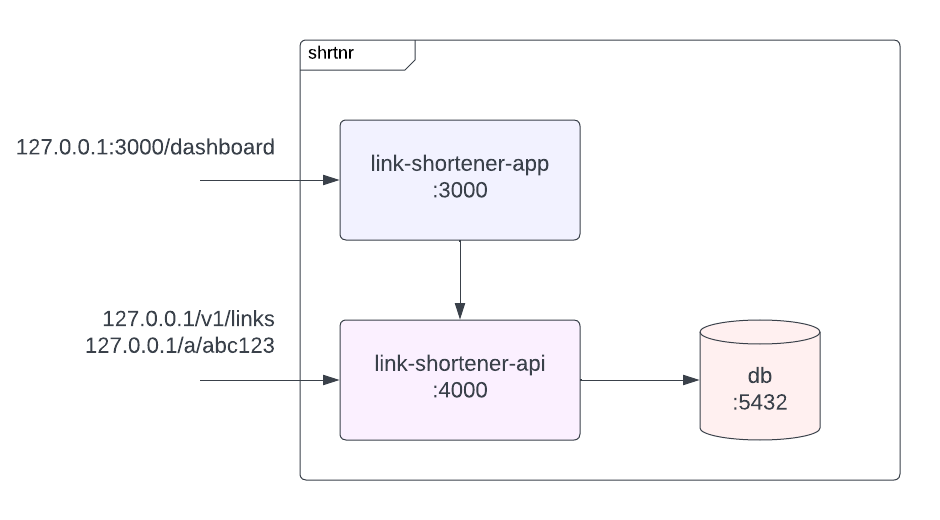
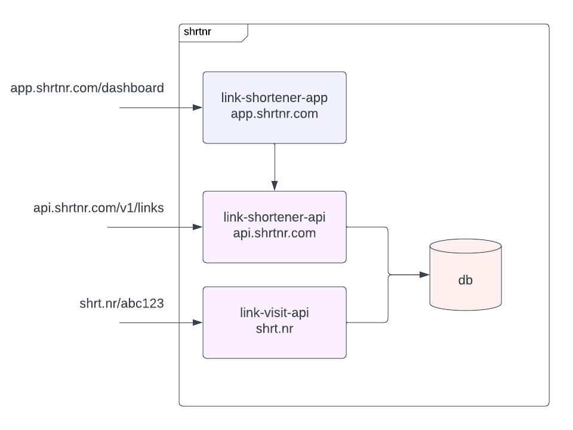

# Architecture

The `shrtnr` application is a simple web app backed by a JSON API. The current application architecture is sufficient for demo purposes, but a real world versioin of this application would require some modifications.

## Current architecture

The application is currently composed of three main parts, each component deployed to `localhost` at a different port.

| Name | Description | Doc | Code |
|---|---|---|---|
| `app` | A [Next.js](https://nextjs.org/) web app | [APP.md](APP.md) | [matthewsaunders/link-shortener-app](https://github.com/matthewsaunders/link-shortener-app) |
| `api` | A golang API | [API.md](API.md) | [matthewsaunders/link-shortener-api](https://github.com/matthewsaunders/link-shortener-api) |
| `db` | A postgres database | - | - |

## Ideal architecture

In an ideal architecture, the majority of the application would remain the same except for the addition of the `public-site` and `visit-api` components. And instead of deploying each component to a different port, each component would be deployed to a specific domain / subdomain.

| Name | Domain | Description |
|---|---|---|
| `public-site` | shrtnr.com | The public site for marketing materials |
| `app` | app.shrtnr.com | The `shrtnr` web app |
| `api` | api.shrtnr.com | The JSON API to support the web app |
| `visit-api` | shrt.nr | The server to handle visit requests and redirect users to the correct link |
| `db` | - | A postgres database |

### Addition of `public-site`

In my past experience, the main website infront of app AuthZ is usually a separate application.

The main reason for separating this site from the app is so that they can be deployed independently. The advantage to this becomes apparent during a failed deploy or a service outage in either `app` or `public-site`.  By separating the two into independent applications, an outage in one does not cause an outage in the other.

The `public-site` could be another NextJS app, but it may also be a different type of application. If I were running it myself I would probably have it be a NextJS app. But in past experiences marketing teams often want to update copy, content, or add pages from templates without requiring an engineer. If that was the case, I would likely use a CMS like [Contentful](https://www.contentful.com/) to populate content and give a level of content control to non-engineers.

### Addition of `visit-api`

The most important behavior for an application like this is that the user is redirected to the correct link as quickly as possible. To make sure that redirects happen as quickly as possible, I would have a service that ONLY handled redirects and could scale independent of the other parts of the architecture.

By separating this functionality from the main `api`, we would excessive traffic to either API affecting the other.

For example, if visits are handled by the main api server and there is a spike in link visits, the time to process and respond to all API requests would increase. This would cause users trying to manage and view their links in the application, which is backed by the API, to have load slower and cause a poor experience for web app users. Similarly, we would not want a large amount of traffic from the web app to cause slower redirects.

### Addition of a cache

Currently every link visit requires a database lookup. In a real world application a cache would be introduced to speed up the average `Link` look up time and improve application performance.

### Addition of an event queue

Once this application hits a meaningful amount of traffic, it would also make sense to further optimize the response time by making the visit endpoint a read only operation. To do this would require adding an event to queue to process visits and create database records asynchronously.

The new event flow would look like this:

1. Find the `Link` record for a given token.
2. Create a visit event on an event queue.
3. Redirect the user to the `Link` destination.
4. (async) Process the visit event from the queue and create a visit record in the database.
